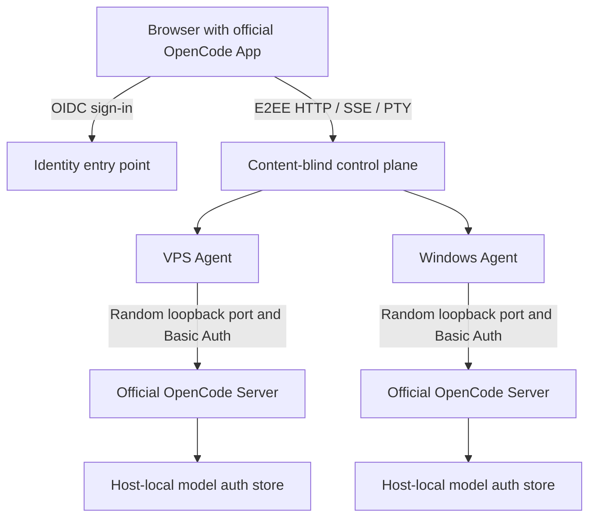

<div align="center">

<h1>AIALRA-OPENCODE</h1>

<p><strong>Secure remote access to the official OpenCode App across a VPS and personal workstation</strong></p>

<p>Zero-patch upstream UI · content-blind relay · Windows and Linux hosts</p>

<p><strong>v0.1.0 reference deployment accepted</strong> · OpenCode 1.18.25 · MIT</p>

<p>
  <a href="#3-quick-start">Quick start</a> ·
  <a href="#4-architecture">Architecture</a> ·
  <a href="#5-security-boundary">Security</a> ·
  <a href="#7-verification-status">Verification</a> ·
  <a href="SECURITY.md">Report a vulnerability</a>
</p>

<p><a href="README.md">简体中文</a> · <a href="README.en.md">English</a></p>

</div>



<div align="center">Figure 1 The official UI encrypts content in the browser, while the control plane relays ciphertext</div>

## 1. Why this project exists

AIALRA-OPENCODE embeds the complete official OpenCode App behind a self-hosted entry point and maps every enrolled machine to a virtual OpenCode Server

The browser can switch between VPS and Windows hosts while retaining projects, sessions, messages, models, permissions, questions, diffs, MCP, tool state, and ordinary PTY access without exposing prompts, answers, code, file bodies, terminal data, or provider keys to the central relay

This project does not maintain an OpenCode fork and does not force third-party models into Codex, since OpenCode Go and other providers remain managed by the official OpenCode configuration and authentication store on each target host

> [!WARNING]
> A private single-owner reference deployment has passed VPS, Windows, OIDC, production cutover, database migration, and rollback acceptance; production addresses, inventory, and receipts are not published here

## 2. Capabilities

| Capability          | Implementation                                                                                     | Status                                                           |
| ------------------- | -------------------------------------------------------------------------------------------------- | ---------------------------------------------------------------- |
| Official UI         | Fetch pinned upstream source and import `AppBaseProviders`, `AppInterface`, and `ServerConnection` | Implemented with zero upstream source patches                    |
| Dual hosts          | One browser connects to independent VPS and Windows Agents                                         | Implemented and locally exercised with a real OpenCode process   |
| HTTP and SSE        | Map `Platform.fetch` to the encrypted relay with cancellation, streaming, and reconnect            | Implemented and covered by regression tests                      |
| Ordinary PTY        | Intercept only the official terminal WebSocket                                                     | Implemented with text, binary, resize, exit, and resume coverage |
| Content-blind relay | Establish ephemeral browser-to-Agent channels                                                      | Implemented with ciphertext-boundary tests                       |
| Route containment   | Generate an allowlist from the pinned OpenAPI document                                             | Unknown methods, paths, URLs, and localhost targets are rejected |
| Supply-chain gate   | Pin source, binaries, OpenAPI, and network exits                                                   | An incompatible candidate is stopped before promotion            |

<div align="center">Table 2.1 Implemented capabilities and evidence status</div>

## 3. Quick start

Prerequisites are Node.js 24.15.x, pnpm 10.33.4, Bun 1.3.14, and an environment that can run Chromium

```bash
git clone https://github.com/AIALRA-0/AIALRA-OPENCODE.git # Fetch the public core
cd AIALRA-OPENCODE # Enter the repository
corepack enable # Select the repository-pinned pnpm
pnpm install --frozen-lockfile # Install the reproducible dependency graph
pnpm check # Run formatting, types, and unit tests
pnpm check:release # Build every component and verify the upstream lock and network exits
pnpm exec playwright install chromium # Install the browser runtime once
pnpm test:e2e # Validate the official UI, encrypted endpoints, and relay recovery
```

This path uses synthetic fixtures, makes no model call, and consumes no provider quota

See [deployment.md](docs/deployment.md) for the identity, TLS, enrollment, and rollback contract

## 4. Architecture

### 4.1. Official App embedding

The build downloads and verifies the OpenCode source selected by `upstream.lock.json`, adds an independent wrapper in a temporary worktree, and leaves every upstream source file unchanged

The wrapper injects a custom `Platform.fetch` into `AppInterface` and intercepts WebSocket only for PTY URLs belonging to enrolled hosts, while every other network exit must match the scanned lockfile baseline

A new fetch, WebSocket, EventSource, Worker, or global network exit fails the candidate build instead of silently bypassing the remote layer

### 4.2. Remote protocol

1. OIDC authenticates the owner and issues a short-lived grant bound to host, scope, expiry, and nonce
2. The browser and target Agent establish an ephemeral X25519 channel
3. HTTP, SSE, and PTY use separate `opencode-http`, `opencode-event`, and `opencode-pty` contexts
4. The Agent validates method, path, body size, and directory parameters before contacting the official loopback OpenCode Server
5. Responses are encrypted at the Agent and decrypted only in the browser

Session identity is always `{hostId, upstreamSessionId}`, preventing collisions between machines

### 4.3. Host Agent

The Agent launches official `opencode serve` as an unprivileged user on a random loopback port with a random Basic Auth password

Provider credentials remain in the host-local OpenCode native store and never enter the browser, control plane, repository, process arguments, or application logs

Version, OpenAPI digest, and capability manifest readback must all match before the Agent exposes a host

See [architecture.md](docs/architecture.md) for protocol and failure behavior

## 5. Security boundary

- Production listeners bind to loopback and sit behind a separate TLS entry point
- Neither the official OpenCode Server nor an Agent has a public listener
- The capability manifest excludes self-update, public sharing, administrative terminal, arbitrary URLs, and unregistered servers
- CSP and SRI prevent the official App from bypassing the remote adapter
- Relay logs are limited to request IDs, host IDs, action categories, sizes, timings, and results
- Agent identity material stays local with owner-only access
- Ordinary PTY is distinct from administrative terminal access, which v1 does not provide

Content-blind relaying cannot protect content after the browser frontend or target host is compromised, so production must use verifiable artifacts, strict CSP, no third-party scripts, and release-digest review

See [threat-model.md](docs/threat-model.md) for assets, controls, and residual risk

## 6. Deployment and updates

The public repository contains reusable core code, upstream locks, tests, and release recipes, while production inventory, identity and edge object IDs, secret references, receipts, backup locations, and rollback state belong in a separate private operations repository

Deployment proceeds through legacy backup, an unprivileged account, immutable releases, OIDC, canary, two-host acceptance, isolated database migration, rollback drill, and production cutover

Daily upstream checks only create candidates, which must pass source, network, Windows and Linux, database-migration, official-App browser, and dual-host canary gates before promotion

## 7. Verification status

The table separates publicly reproducible source checks from private reference-deployment acceptance; the reference deployment is in production without publishing its addresses, hosts, or accounts

| Surface                            | Current result                                                   | Evidence boundary                                                                                        |
| ---------------------------------- | ---------------------------------------------------------------- | -------------------------------------------------------------------------------------------------------- |
| Protocol, Agent, and control plane | 48 tests pass                                                    | Auth, replay, host isolation, database, routes, configuration-key isolation, backpressure, and reconnect |
| Official App build                 | 2,582 modules build                                              | OpenCode 1.18.25 source remains unpatched and entry SRI verifies                                         |
| Network exit scan                  | 11 `Platform.fetch` references and one intercepted PTY WebSocket | No EventSource or Worker, with one lockfile-approved global fetch                                        |
| Encrypted local E2E                | HTTP, SSE, PTY, route rejection, and version readback pass       | Uses a real OpenCode 1.18.25 process without model calls                                                 |
| Official UI browser E2E            | Chromium passes                                                  | OpenCode Go is visible and the same page recovers after relay restart                                    |
| Production dual host               | Private reference deployment accepted                            | Both hosts read back OpenCode 1.18.25 and the intended model; addresses remain private                   |

<div align="center">Table 7.1 Current verification scope and evidence boundary</div>

## 8. Status and limitations

v0.1.0 targets single-owner self-hosting and has passed one private dual-host reference deployment

The first release excludes multi-tenancy, administrative terminals, unregistered third-party servers, public session sharing, browser-side provider-key management, and direct production promotion on upstream discovery

Only the source, assets, OpenAPI document, and network baseline pinned in `upstream.lock.json` are supported

## 9. Maintenance and license

- Use GitHub Issues for reproducible bugs without real sessions, logs, paths, or credentials
- Use [private vulnerability reporting](SECURITY.md) for security defects
- Read [CONTRIBUTING.md](CONTRIBUTING.md) before changing trust boundaries
- The project uses the [MIT License](LICENSE)
- See [THIRD_PARTY_NOTICES.md](THIRD_PARTY_NOTICES.md) for upstream attribution and non-endorsement

AIALRA-OPENCODE is independent and is not produced, sponsored, or endorsed by OpenCode, Anomaly, or any model provider
