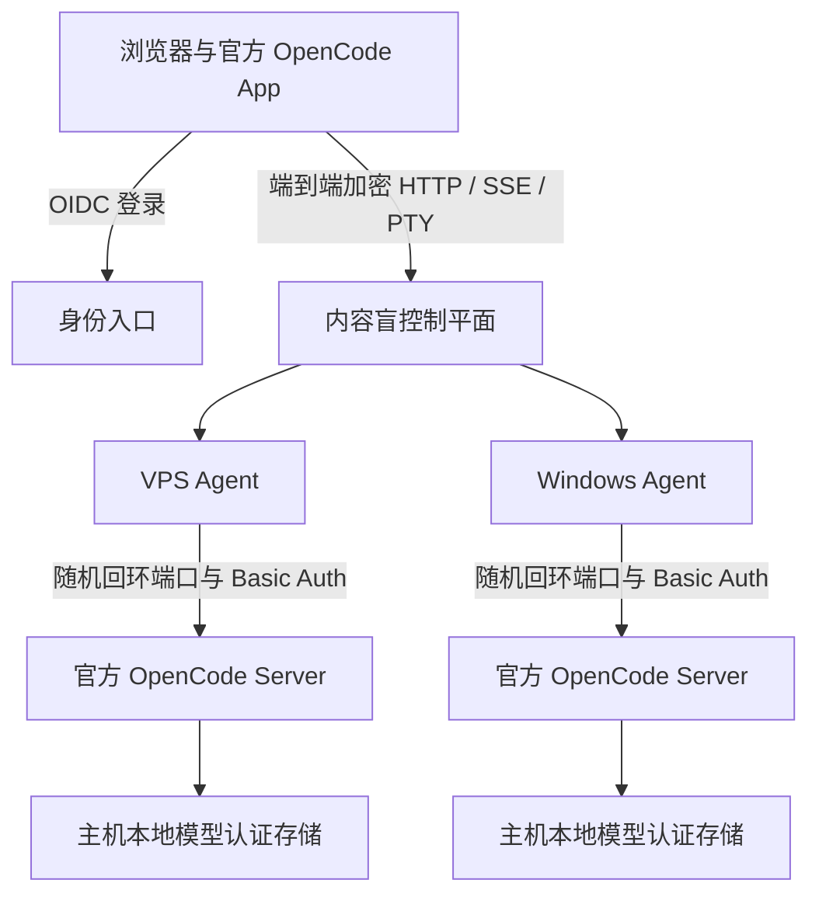

<div align="center">

<h1>AIALRA-OPENCODE</h1>

<p><strong>让官方 OpenCode App 安全连接 VPS 与个人电脑</strong></p>

<p>上游界面零补丁 · 内容盲中继 · Windows 与 Linux 双主机</p>

<p><strong>v0.1.0 参考部署已验收</strong> · OpenCode 1.18.25 · MIT</p>

<p>
  <a href="#3-快速开始">快速开始</a> ·
  <a href="#4-系统架构">系统架构</a> ·
  <a href="#5-安全边界">安全边界</a> ·
  <a href="#7-验证状态">验证状态</a> ·
  <a href="SECURITY.md">安全报告</a>
</p>

<p><a href="README.md">简体中文</a> · <a href="README.en.md">English</a></p>

</div>



<div align="center">图 1 官方界面在浏览器内加密，控制平面只转发密文</div>

## 1. 项目价值

AIALRA-OPENCODE 把完整的官方 OpenCode App 嵌入自托管入口，并把每台已登记主机映射为一台虚拟 OpenCode Server

浏览器可以在 VPS 和 Windows 主机之间切换，使用项目、会话、消息、模型、权限、提问、文件差异、MCP、工具状态和普通 PTY，而不把提示词、回复、代码、文件正文、终端内容或模型密钥交给中央中继

本项目不会维护 OpenCode fork，也不会把第三方模型强塞进 Codex，OpenCode Go、Kimi 或其他供应商仍由目标主机上的官方 OpenCode 配置和认证存储负责

> [!WARNING]
> 当前版本已完成单所有者参考部署的 VPS、Windows、OIDC、生产切换、数据库迁移和回滚验收；生产地址、清单和部署记录不进入公开仓库

## 2. 核心能力

| 能力        | 实现方式                                                                                  | 当前状态                       |
| ----------- | ----------------------------------------------------------------------------------------- | ------------------------------ |
| 官方界面    | 构建时获取锁定版本源码，直接导入 `AppBaseProviders`、`AppInterface` 和 `ServerConnection` | 已实现，上游源码零补丁         |
| 双主机      | 一个浏览器连接 VPS 与 Windows Agent，每台主机拥有独立会话命名空间                         | 已实现，本地真实进程已验证     |
| HTTP 与 SSE | `Platform.fetch` 映射到端到端加密中继，支持取消、分块和重连                               | 已实现并通过回归测试           |
| 普通 PTY    | 只接管官方终端 WebSocket，支持文本、二进制帧、缩放、退出和恢复                            | 已实现并通过本地端到端测试     |
| 内容盲中继  | 浏览器与 Agent 建立临时加密通道，控制平面只处理授权、路由和密文                           | 已实现并通过密文边界测试       |
| 路由收口    | 允许列表由锁定版 OpenAPI 生成，未知方法、未知路径、任意网址与任意 localhost 全部拒绝      | 已实现并通过拒绝测试           |
| 供应链门    | 锁定 tag、commit、源码摘要、二进制摘要、OpenAPI 摘要和网络出口基线                        | 已实现，升级候选失败时停止推广 |

<div align="center">表 2.1 已实现能力与证据状态</div>

## 3. 快速开始

前置条件为 Node.js 24.15.x、pnpm 10.33.4、Bun 1.3.14，以及可运行 Chromium 的环境

```bash
git clone https://github.com/AIALRA-0/AIALRA-OPENCODE.git # 获取公开核心源码
cd AIALRA-OPENCODE # 进入仓库
corepack enable # 使用仓库锁定的 pnpm
pnpm install --frozen-lockfile # 安装可复现依赖
pnpm check # 执行格式、类型和单元测试
pnpm check:release # 构建全部组件并核对上游锁与网络出口
pnpm exec playwright install chromium # 首次安装浏览器测试运行时
pnpm test:e2e # 验证官方界面、加密双端和控制平面重连
```

这条路径只使用合成测试内容，不连接真实模型账户，也不会产生模型用量

生产安装需要身份、TLS、主机登记和回滚状态，见 [部署说明](docs/deployment.md)

## 4. 系统架构

### 4.1. 官方 App 嵌入

构建脚本下载并核对 `upstream.lock.json` 指定的 OpenCode 源码，在临时工作树中加入独立包装入口，官方源文件保持零修改

包装层向 `AppInterface` 注入自定义 `Platform.fetch`，并只对登记主机的 PTY 地址接管 WebSocket，其他网络出口必须与锁文件中的扫描基线一致

新增 `fetch`、WebSocket、EventSource、Worker 或全局网络出口会让候选构建失败，而不是静默绕过远程层

### 4.2. 远程协议

一次浏览器操作的内容路径如下

1. OIDC 验证所有者并签发绑定主机、范围、期限和随机数的短时授权
2. 浏览器与目标 Agent 通过临时 X25519 密钥建立加密通道
3. HTTP、SSE 与 PTY 分别使用 `opencode-http`、`opencode-event` 和 `opencode-pty` 上下文
4. Agent 校验方法、路径、正文大小和目录参数，再访问随机回环端口上的官方 OpenCode Server
5. 响应在目标 Agent 加密，到浏览器才解密

会话键固定为 `{hostId, upstreamSessionId}`，两台主机出现相同上游会话编号时不会混淆

### 4.3. 主机 Agent

Agent 使用普通用户启动官方 `opencode serve`，服务只监听随机回环端口，并启用随机 Basic Auth 密码

OpenCode Go 等模型认证只保存在该主机的 OpenCode 原生存储中，不进入浏览器、控制平面、仓库、进程参数或应用日志

Agent 会读回 OpenCode 版本、OpenAPI 摘要和能力清单，任何一项不符都会把主机标记为不兼容并停止代理

完整协议和失败行为见 [架构说明](docs/architecture.md)

## 5. 安全边界

- 生产控制平面必须只监听回环地址，由独立 TLS 入口代理
- 官方 OpenCode Server 与 Agent 均不开放公网监听
- 路由能力清单拒绝自升级、公开分享、管理员终端、任意网址和未登记服务器
- 浏览器静态入口使用严格 CSP 与 SRI，官方 App 不能直接绕过远程适配层
- 控制平面日志只允许请求 ID、主机 ID、动作类别、字节数、时间和结果，不允许正文、绝对路径或密钥
- Agent 配置包含主机身份私钥，Linux 权限必须为 `0600`，Windows 使用当前用户受保护目录
- 普通远程 PTY 与管理员终端是不同安全能力，本项目第一版不提供管理员终端

内容盲中继不能防御已经被攻陷的浏览器前端或目标主机，恶意前端仍可能在加密前读取内容，生产部署必须使用可核对制品、严格 CSP、无第三方脚本和发布摘要复核

完整资产、威胁和残余风险见 [威胁模型](docs/threat-model.md)

## 6. 部署与更新

公开仓库只保存可复用核心、上游锁、测试和发布配方，生产主机清单、身份与边缘对象标识、签名材料引用、备份位置、部署回执和回滚状态必须保存在独立私有运维仓库

部署顺序固定为旧服务备份、独立用户、不可变发布目录、OIDC、Canary、两台主机验收、旧数据库隔离迁移、回滚演练和生产切换

每日上游检查只创建候选变更，必须通过源码摘要、网络出口、Windows 与 Linux、数据库迁移、官方 App 浏览器和双主机 Canary 才能推广

生产保留当前版本与前两个版本，繁忙主机等待会话和 PTY 空闲，健康检查或中继错误异常时恢复上一版本

## 7. 验证状态

下表同时区分可公开复现的源码检查和私有参考部署验收；参考部署已切换生产入口，但不公开真实地址、主机或账户信息

| 检查对象               | 当前结果                                              | 证据边界                                                           |
| ---------------------- | ----------------------------------------------------- | ------------------------------------------------------------------ |
| 协议、Agent 与控制平面 | 48 个测试通过                                         | 包含认证、重放、跨主机、数据库、路由、配置密钥隔离、背压和断线恢复 |
| 官方 App 构建          | 2582 个模块构建成功                                   | OpenCode 1.18.25 源码零补丁，入口资源 SRI 已核对                   |
| 网络出口扫描           | 11 个 `Platform.fetch` 引用、1 个已接管 PTY WebSocket | 未发现 EventSource 或 Worker，唯一全局 fetch 在锁定允许列表内      |
| 加密本地端到端         | HTTP、SSE、PTY、拒绝路由和版本读回全部通过            | 使用真实 OpenCode 1.18.25 进程，不调用模型                         |
| 官方界面浏览器端到端   | Chromium 通过                                         | 能看到 OpenCode Go，控制平面重启后同页恢复 HTTP 与事件通道         |
| 生产双主机             | 私有参考部署验收通过                                  | VPS 与 Windows 均读回 OpenCode 1.18.25 和预期模型，地址不公开      |

<div align="center">表 7.1 当前验证范围与证据边界</div>

## 8. 项目状态与限制

当前为 v0.1.0，适合单所有者自托管；公开核心已在一套私有双主机参考部署中完成验收

第一版不包含多租户、管理员终端、未登记的第三方 OpenCode Server、向外部网站分享会话、浏览器端模型密钥管理或发现新版后直接生产升级

OpenCode 上游接口仍可能变化，只有 `upstream.lock.json` 固定的源码、发行包、OpenAPI 和网络出口组合属于当前兼容范围

## 9. 维护与许可

- 缺陷与功能请求使用 GitHub Issues，但不要提交真实会话、日志、路径或凭据
- 安全问题使用 [GitHub 私密漏洞报告](SECURITY.md)
- 贡献前阅读 [CONTRIBUTING.md](CONTRIBUTING.md)
- 项目采用 [MIT License](LICENSE)
- OpenCode 与其他依赖的来源和非背书声明见 [THIRD_PARTY_NOTICES.md](THIRD_PARTY_NOTICES.md)

AIALRA-OPENCODE 是独立项目，不由 OpenCode、Anomaly 或模型供应商制作、赞助或背书
